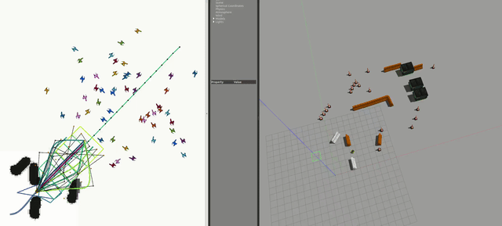

# MPC Planner (VSCode Docker)


# Install
In VSCode install these extensions:

- https://marketplace.visualstudio.com/items?itemName=ms-vscode-remote.remote-containers
- https://marketplace.visualstudio.com/items?itemName=ms-azuretools.vscode-docker

Clone this repository. In VSCode: `open_folder` -> open `mpc_planner_ws`. It will show a pop-up: click `Reopen in container`. It will build the container. This will take some time.

Once done, in the terminal run:

```bash
chmod +x setup.sh
chmod +x build.sh
./setup.sh
```

This will clone required repositories and will install dependencies.

## Generating a Solver (Forces Pro)
Outside of the docker container, open a terminal. 

This step requires 

- a specific python3.8.10 environment (see `requirements.txt`). 
- a regular Forces Pro license placed under `~/forces_pro_client/` *outside* of the container

Navigate to `mpc_planner_ws/src/mpc_planner`. If you have `conda` installed, this may be the easiest. If not, you can use `pyenv`.

### Conda
With conda, create a new environment

```bash
conda create -n mpc_planner python=3.8.10
conda activate mpc_planner
pip install -r requirements.txt
```

### Pyenv + Poetry
If you have python3.8.10 installed. Install poetry (`pip install poetry`). Then run `poetry install --no-root`.

If you do not have it (most likely), you can safely install it via `pyenv`, steps below.

```bash
curl https://pyenv.run | bash
```


Add the following to ~/.bashrc:

```bash
export PYENV_ROOT="$HOME/.pyenv"
[[ -d $PYENV_ROOT/bin ]] && export PATH="$PYENV_ROOT/bin:$PATH"
eval "$(pyenv init -)"
```

Install pyenv system dependencies (from https://github.com/pyenv/pyenv/wiki#suggested-build-environment):

```bash
sudo apt update; sudo apt install build-essential libssl-dev zlib1g-dev \
libbz2-dev libreadline-dev libsqlite3-dev curl \
libncursesw5-dev xz-utils tk-dev libxml2-dev libxmlsec1-dev libffi-dev liblzma-dev
```

Install python3.8.10 and activate it. In some cases installing with `pyenv local 3.8.10` may work, but in general `pyenv global 3.8.10` is necessary.

```
pyenv install 3.8.10
pyenv global 3.8.10
```

To setup the virtual environment run:

```bash
pip3 install poetry
poetry install --no-root
```

### Generate the solver
In a docker, a floating license is needed to run the solver. If you have such a license, set `solver_settings/floating_license` in `mpc_planner_jackalsimulator/config/settings.yaml` to `true`. 

<details>
    <summary><i>Floating License Forces Pro Solver</i></summary>

Go to my.embotech.com, log in to your account. Click on a license -> Download `Floating Licenses Proxy Standalone (Linux 64-bit) - FORCES PRO v5.1.0 onwards` -> unzip.

In the folder, `chmod +x forcespro_floating_licenses_proxy`. Then you can run the proxy with:
`./forcespro_floating_licenses_proxy`.

</details>

With the solver set up, run:

```
poetry run python mpc_planner_jackalsimulator/scripts/generate_jackalsimulator_solver.py true
```

You should see output indicating that the solver is being generated.


# Build
In VSCode, press Ctrl + Shift + B. Select `Build` (or alternatively run `build.sh`). This will build the ROS workspace. Default system is `jackalsimulator`. If you want to build a difference planner, you can change it in `build.sh`.

# Run

<details open>
    <summary><b>Jackal Simulator</b></summary>

In VSCode, press Ctrl + Shift + B. Select `Run Simulator`.
</details>

<details>
    <summary><b>Jackal</b></summary>

You need to configure the following:

- *Your IP:*. Run `ip a`, copy the ip address of your ethernet connection into `connect_to_jackal.sh` at `ROS_IP`. 
- *Which Jackal:* See the last line in `connect_to_jackal.sh`.
- *The ROS_MASTER_URI and ROS_IP:* Run `source connect_to_jackal.sh`

Finally, run the planner: `roslaunch mpc_planner_jackal ros1_jackal.launch`.

To change the detected obstacles, see `ros1_jackal.launch`.
</details>

# Examples

### Jackal Simulator
Clearpath Jackal ground robot simulator  (`mpc_planner_jackalsimulator`) with dynamic obstacles.


ROS Navigation stack  (`mpc_planner_rosnavigation`) with static and dynamic obstacles. This example features
- Curvature-Aware MPC (https://ieeexplore.ieee.org/document/10161177)
- Topology-Driven MPC for dynamic obstacle avoidance (https://arxiv.org/pdf/2401.06021)
- Decomp Util for static obstacle avoidance ()




